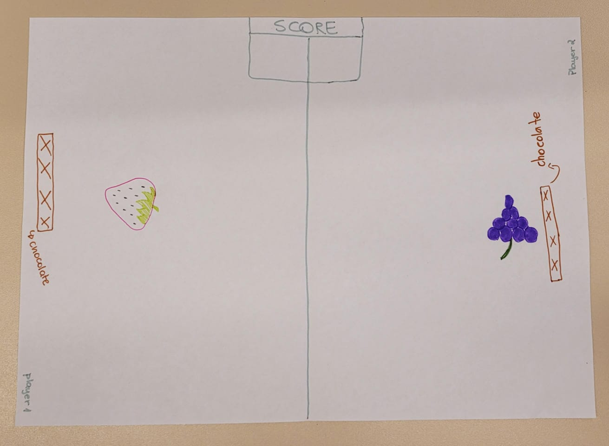
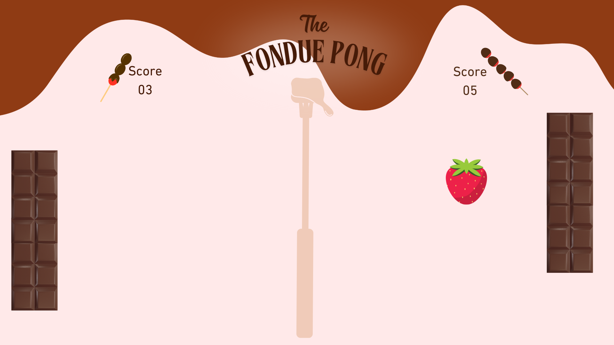

# Relatório - Reinventando Pong

## 1. Introdução  
&emsp; Nessa atividade tivemos como objetivo recriar o design do Jogo Pong. Para isso, utilizamos a receita de fondue como proposta criativa, exercitando e aplicando os conceitos de Framework MDA, Concept Art e Game Design, o que nos permitiu criar o **"The Fondue Pong"**.
 
---

## 2. Pesquisa e Análise Inicial  
&emsp; Mecânica: o jogo Pong consiste em duas barras, uma bola e um sistema de pontuação. As barras se movem no eixo y, ou seja, na vertical.

&emsp; Dinâmica: os jogadores controlam as barras para se defender e rebater a bola para atacar, aquele que acerta a área delimitada do oponente pontua.

&emsp; Estética: é inspirada, de forma simplificada, no esporte de tênis.

&emsp; O Pong é um jogo envolvente e jogável justamente por seu MDA simples e intuitivo, além da sensação de competitividade.

&emsp; Os elementos principais de diversão e desafio são as barras e a bola, pois com as barras os jogadores movimentam a bola de forma imprevisível e competitiva um para o outro.

---

## 3. Proposta de Reinvenção  
&emsp; O tema do jogo é **"The Fondue Pong"** e o cenário é representado por um ambiente imaginário de fondue.

&emsp; Os elementos remetem a temática de fondue do jogo, na qual as barras de chocolate representam as barras, o morango representa a bola, os espetinhos de morango representam a pontuação e o espeto de fondue representa a delimitação entre os dois jogadores.

&emsp; A mecânica continua a mesma da versão original do Pong.

&emsp; Essa versão busca melhorar a experiência do usuário por meio de uma **temática descontraída** que remete ao fondue.

   Figura 1 - Concept Art do jogo "The Fondue Pong" 

    

   Fonte: Elaboração própria (2025)

&emsp; O esboço foi desenvolvido a partir de um insight mútuo que tivemos, olhando para um marca-texto rosa pensamos e falamos ao mesmo tempo sobre usarmos um morango - nossa fruta preferida.

&emsp; A partir disso, refletindo sobre o que poderia representar as barras no jogo, decidimos que a temática seria em torno de uma receita de fondue, já que morango e chocolate fazem uma combinação perfeita.

&emsp; Na ideia inicial haviamos adicionado o elemento uva como bola também, mas ao refletirmos sobre a mecânica optamos por mantê-la no formato original e usar apenas uma "bola", nesse caso, o morango.

---

## 4. Tela Digital do Jogo  
A seguir é possível visualizar versão digital da tela do jogo "The Fondue Pong".

   Figura 2 - Tela Digital do jogo "The Fondue Pong" 

    

   Fonte: Elaboração própria (2025)

*- Como o concept foi adaptado para o formato digital?*

*- Quais elementos visuais foram aprimorados?*  

*- O uso de cores, formas e layout foi pensado para reforçar que aspectos do jogo?*  

---

## 5. Reflexão e Aprendizados  
1. Quais foram os maiores desafios enfrentados durante o processo de criação?

    - Aira: No início não sabia ao certo como fazer, na verdade não conhecia nem o jogo, mas consegui desenvolver algo legal, então diria que o início foi mais desafiador, depois conseguimos trabalhar em cima da ideia central e o pong foi surgindo.

    - Sara: conseguir compartilhar com a Aira a ideia que eu tinha para colocarmos no papel e deixar o nome do jogo de forma visível enquanto mantinha a localização e as cores da tipografia e da calda de chocolate.

2. Que habilidades foram desenvolvidas ou aprimoradas ao longo da atividade?  

    - Aira: Aprendi a pensar fora da caixa e deixar a imaginação fluir, construindo uma ideia em dupla, onde cada uma compartilhava sua perspectiva, o que contribuiu para a colaboração. Além disso, foi legal redesenhar/remodelar o desing do canva, sou iniciante ainda nisso, então foi bom colocar em prática. Também tive mais uma experiência no github e em fazer comits em uma atividade coletiva.

    - Sara: aprendi a usar elementos de shadow no Canva e a editá-los para dar profundidade a outros elementos da imagem.

---

**📝 Formato de Entrega:**  
- O relatório pode ser submetido no **GitHub** em **Markdown** `.md` ou como **PDF** `.pdf` **compartilhado via Drive**.  
- **Nome do arquivo:** `RelatorioPong_Nome1-Nome2`  

📌 **Prazo de entrega:** Sexta-feira, às 23h59.

